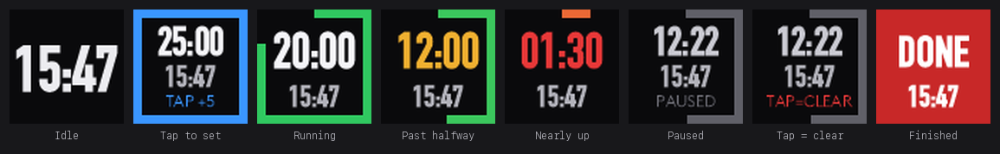

# Pomodoro Clock — a Loupedeck / Logi plugin

A clock button that doubles as a Pomodoro timer.

Left alone it just shows the time, the way a clock button should. Tap it and it becomes a countdown:
each tap adds five minutes, up to thirty. A second and a half after your last tap it starts counting
down, with the wall clock tucked underneath — and the button's border drains around the edge as the
session runs, green while you have time, amber as it gets on, red for the closing stretch.



## How it behaves

| You do this | It does this |
| --- | --- |
| Tap once from the clock | Sets a 5 minute timer |
| Keep tapping | 10, 15, 20, 25, 30 — then wraps back to 5 |
| Stop tapping | After 1.5 seconds it commits and starts counting down |
| Tap while running | Pauses; the countdown dims and the border goes grey |
| Tap again after a moment | Resumes with the time it had left |
| Tap twice quickly | Cancels and goes back to being a clock |
| Timer reaches zero | Flashes red and says `DONE` |
| Tap while it's flashing | Dismisses it back to the clock |

While a timer is paused the caption reads `TAP=CLEAR` for as long as another tap would clear it, then
settles to `PAUSED`. The shortcut is meant to be discoverable from the button rather than something
you have to remember.

While a timer is simply running there is no caption at all — the border already shows how far along
you are, so the countdown gets the space instead.

If a session finishes while you are away from the desk, the button stops flashing on its own after
two minutes rather than blinking at an empty room.

### Two readings of the same thing

The border sweeps continuously; the digits step through three discrete colours. Deliberately
different — two continuous gradients competing for attention just look mushy.

| Time left | Digits |
| --- | --- |
| Above half | White |
| Half to the closing stretch | Amber |
| Closing stretch | Red |

"The closing stretch" is whichever is **shorter**: two minutes, or a fifth of the session. Two minutes
is 40% of a five-minute timer, so a purely absolute threshold would leave a short session red for half
its life and the signal would stop meaning anything. A 25 minute timer turns red at 2:00, a 5 minute
one at 1:00.

## Clock format

The clock follows your operating system — one action, nothing to configure. On macOS that is
*System Settings → General → Date & Time → 24-hour time*; on Windows it is the short time format in
Region settings. The setting is re-read every five minutes, so flipping it takes effect on its own.

To pin the format instead, set `ClockFormatOverride` in `src/PomodoroFace.cs` to `true` or `false`.

AM/PM is never drawn, even in 12-hour mode: it costs roughly a third of the button width and the hour
already tells you which it is.

> **macOS gotcha, if you are writing your own plugin.** .NET does *not* see macOS's 24-hour switch. A
> Mac with 24-hour time enabled still reports `en-US` with a `h:mm tt` short time pattern, because
> macOS keeps that switch (`AppleICUForce24HourTime`) outside the locale identifier. Asking
> `CultureInfo` alone gets you a 12-hour clock on a 24-hour Mac. This plugin reads the preference
> directly on macOS and falls back to `CultureInfo` when it is unset — which is also the correct answer
> on Windows, where the preference really does live in the short time pattern.

## Requirements

- **Logi Plugin Service 6.0+** (ships with [Loupedeck](https://loupedeck.com/downloads/) or
  [Logi Options+](https://www.logitech.com/software/logi-options-plus.html))
- A Loupedeck CT-family device — Loupedeck CT, Live, Live S, or the Razer Stream Controllers
- **.NET SDK** to build. Match the runtime your installed PluginApi targets — see the note below.

## Building

```sh
git clone https://github.com/USERNAME/PomodoroClockPlugin.git
cd PomodoroClockPlugin
./build.sh          # or: dotnet build
```

`build.sh` is a thin wrapper that falls back to a per-user SDK in `~/.dotnet` when `dotnet` is not
already on `PATH`; it passes any extra arguments straight through to `dotnet build`.

The build drops a `PomodoroClockPlugin.link` file into the Logi Plugin Service `Plugins` directory
pointing back at `bin/Debug`, then reloads the plugin via the `loupedeck:` deep link. Unhide
**Pomodoro Clock** under *Show and hide plugins* in the Loupedeck app, then drag the **Pomodoro Clock**
action from the *Pomodoro* group onto any touch button.

In a headless or sandboxed shell the reload deep link can take the build down with it. Skip it with:

```sh
./build.sh -p:ReloadPlugin=false
```

…and reload by hand afterwards:

```sh
open "loupedeck:plugin/PomodoroClock/reload"
```

Prefer that deep link over restarting the service, for two reasons. It is far quicker (~100 ms versus a
full restart), and killing Logi Plugin Service outright can leave the plugin **quarantined** — the next
start then logs `Plugin 'PomodoroClock' is disabled as it had crashed before` and registers none of its
actions. Cold starts are also unreliable for link-loaded development plugins: they sometimes log
`Cannot load plugin ... because plugin 'PomodoroClock' is already loaded` and never load it. A deep-link
reload always recovers. If the button is ever blank after a reboot, reload rather than assuming the
plugin broke.

### A note on the target framework

The official SDK docs tell you to install the .NET 8 SDK, but Logi Plugin Service 6.4 ships a
`PluginApi.dll` built against **.NET 10**, and a `net8.0` plugin will not compile against it:

```
error CS1705: Assembly 'PluginApi' ... uses 'System.Runtime, Version=10.0.0.0' which has a higher
version than referenced assembly 'System.Runtime, Version=8.0.0.0'
```

This project therefore targets `net10.0`. If you are on an older Logi Plugin Service, check what
`PluginApi.dll` targets and set `<TargetFramework>` in `src/PomodoroClockPlugin.csproj` to match.

## Tests

```sh
dotnet test tests/PomodoroClock.Tests
```

`PomodoroSession` — the whole state machine — is deliberately free of Loupedeck types, so the tests
compile it in directly and run anywhere, with or without Logi Plugin Service installed.

## Layout

```
src/
  PomodoroSession.cs               state machine: presses and time in, state out
  PomodoroFace.cs                  all the drawing, on a scaled 80px reference layout
  Actions/PomodoroClockCommand.cs  the Loupedeck command that joins the two
  package/metadata/
    LoupedeckPackage.yaml          plugin manifest
    DefaultIconTemplate.ict        full-bleed image, no text label (see below)
    Icon256x256.png                plugin icon
tests/PomodoroClock.Tests/         state machine tests
```

The split is the point: `PomodoroSession` holds the behaviour and is easy to test, `PomodoroFace`
holds the pixels, and the command is thin glue that owns a 200 ms timer.

`PomodoroFace.RenderKey` deserves a mention — `ActionImageChanged()` redraws *every* button on the
device, so the command builds a short string describing what is currently visible and only asks for a
repaint when that string changes. Without it, a 200 ms tick would have the whole console
re-rendering continuously for no visible gain.

## Two things that will bite you when drawing your own button faces

Both cost real time to find, and neither is visible if you only inspect the bitmap your plugin
produces.

### The service composites your bitmap through an Icon Template

`GetCommandImage` is not what reaches the screen. Logi Plugin Service lays the button out from an
[Icon Template](https://logitech.github.io/actions-sdk-docs/csharp/icons/icon-templates/), and the
global default is:

```
Image → x:15  y:0   width:70  height:70    your bitmap, squeezed into 70% and offset left
Text  → x:0   y:70  width:100 height:30    the action name, printed over the button
```

So a plugin that ships no template gets a shrunken face with a label under it, and **overriding
`GetCommandDisplayName` does not remove that label** — the text belongs to the template, not to your
code. Ship `metadata/DefaultIconTemplate.ict` with a full-bleed image item and an invisible text item,
as this project does.

Templates resolve at four precedence levels, highest first: **user** (`ActionIcons/` in the profile
directory, written when someone edits the icon in the Icon Editor) → **action**
(`icontemplates/<full.class.Name>.ict`) → **plugin** (`metadata/DefaultIconTemplate.ict`) → global
default. A user-level template outranks yours, so opening the Icon Editor on a button can bring the
label and the inset back; "Reset icon to default" clears it.

### `BitmapBuilder.DrawText` does not vertically centre

Given a box, it places the baseline at `y + height / 2 + ~6.5` and grows the glyphs *upward* from
there. So the text is roughly centred at small sizes and drifts towards the top as it gets larger — at
44px on an 80px button it sits 19px too high. `PomodoroFace.DrawCentred` corrects for it using two
measured constants, and is only sound for capitals and digits, which is all this face draws.

## Tweaking it

The numbers worth changing are the `static readonly` fields at the top of `src/PomodoroSession.cs`:

| Field | Default | What it does |
| --- | --- | --- |
| `Step` | 5 min | How much each tap adds |
| `MaxDuration` | 30 min | Where the tapping wraps around |
| `CommitDelay` | 1.5 s | How long it waits after your last tap before starting |
| `DoublePressWindow` | 1.2 s | How quick a second press has to be to cancel |
| `FinishedTimeout` | 2 min | How long it flashes before giving up |

`DoublePressWindow` is generous on purpose. It started at 600 ms — borrowed from mouse double-click
convention — which was unusable in practice, because you are reacting to the button changing to
`PAUSED` rather than tapping blind, and a press on the touch panel is slower than a mouse click.

Colours, font and the layout bands are at the top of `src/PomodoroFace.cs`. The time is set in
**DIN Condensed** on macOS and **Bahnschrift** on Windows — condensed faces let the digits render
substantially larger in 80px than a normal-width one. If neither font is installed the renderer falls
back to the system default, which is a plainer clock rather than a broken one. Font names passed to
`DrawText` resolve against installed system fonts, and a missing one falls back silently, so there is
no way to detect availability from the API.

The font sizes are at their practical maximum for an 80px button and were found by rendering a sweep
rather than by eye: the idle clock clips at 49 so it sits at 44, and the countdown starts touching the
border at 39 so it sits at 35. Width is the binding constraint in both cases, not height. If you
change the font, re-check those two numbers.

## Licence

MIT — see [LICENSE](LICENSE).
